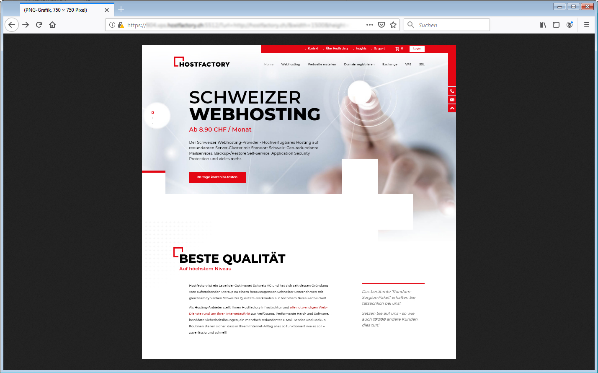
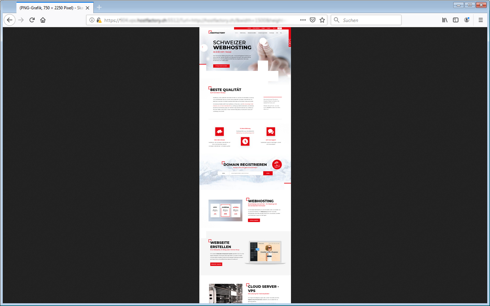

# Basic website screenshot webservice
Node.js script for start a simple webservice to taking screenshots of a website. (Windows only)

## Usage example
Start the web-service in the CMD:
```
node C:\Users\Administrator\Desktop\imageservice\main.js
```

Open your browser and connect to the service with all parameters:
```
https://[[SERVICE-IP]]:5512/?url=http://thewebsite.ch/&width=1500&height=1500&secret=123456&zoom=0.1
```

You should get the folowing output:


Its also posible to create interesting overviews from a height website:



## Installation
* Install node.js 
* Install Chrome

## References
[Headless chrome parameters](https://peter.sh/experiments/chromium-command-line-switches/)

## Todo list
- [ ] Parametervalidator Class
- [ ] CMD generator Class
- [ ] Errorhandling for none-reachable/http-statuscode/etc.